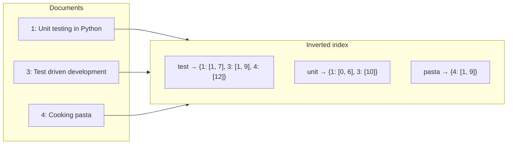

## Inverted index in one picture

```mermaid
flowchart LR
  subgraph Documents
    D1["1: Unit testing in Python"]
    D3["3: Test driven development"]
    D4["4: Cooking pasta"]
  end
  subgraph Index["Inverted index"]
    T1["test → {1: [1, 7], 3: [1, 9], 4: [12]}"]
    T2["unit → {1: [0, 6], 3: [10]}"]
    T3["pasta → {4: [1, 9]}"]
  end
  D1 & D3 & D4 --> Index
```

A book's index works the same way: look up a word, get the pages. Building it is slow once; every search after that is fast.
