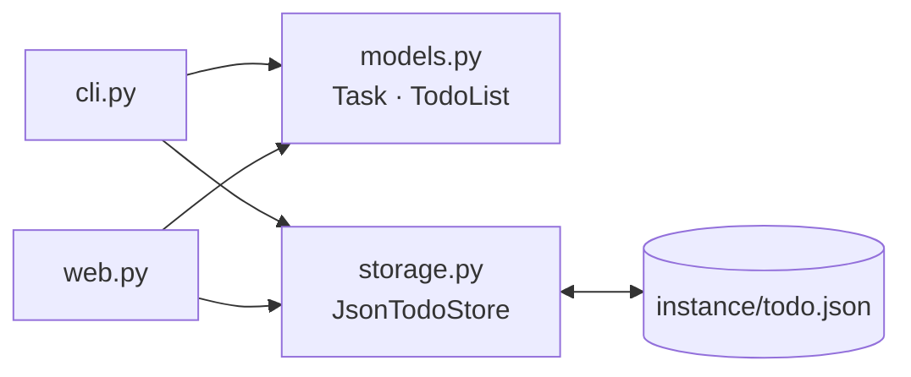

## The key idea: model ↔ storage ↔ interface

```mermaid
flowchart LR
  CLI[cli.py] --> M[models.py<br/>Task · TodoList]
  WEB[web.py] --> M
  CLI --> ST[storage.py<br/>JsonTodoStore]
  WEB --> ST
  ST <--> F[(instance/todo.json)]
```

Both interfaces share **one** data file (`instance/todo.json`). Add a task in the terminal and refresh the browser.
